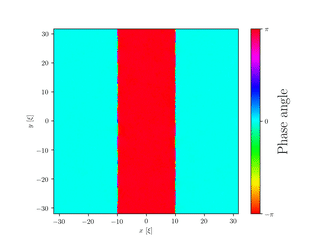
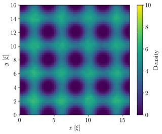
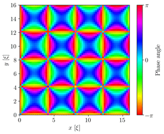

# CQD - The Gross-Pitaevskii equation (GPE): Dynamics of solitons and vortices
The GPE is a mean field equation that has been incredibly successful in describing the dynamics of Bose Einstein condensates (BECs). The equation features a non-linear term and thus allows for stable soliton solutions in 1D and additional topological defects such as vortices in 2D. The goal of this project is to study these phenomena using the split-step Fourier method.

We provide three configurable models:
1. [Solitons in a 1d BEC](https://github.com/ThorstenBuss/CQD/blob/master/solitons1d.py)
2. [Solitons in a 2d BEC](https://github.com/ThorstenBuss/CQD/blob/master/solitons2d.py)
3. [Vortices in a 2d BEC](https://github.com/ThorstenBuss/CQD/blob/master/vortices2d.py)

## Running a model

In order to run the scripts, copy the files to a newly created project directory and simply use

```bash
$ python <model_name>
```

Here, replace `model_name` by either `solitons1d`, `solitons2d`, or `vortices2d`.

For more detailed information on the configurations and the models themselves, have a look at the [project report]() and the comments within the scripts.

## Simulation Results

### Solitons in a 2d BEC

 

### Vortices in a 2d BEC

 

__References:__
* Sebastian Erne Diplomarbeit
* M. Karl and T. Gasenzer New. J. Phys. 19:093014 (2017)